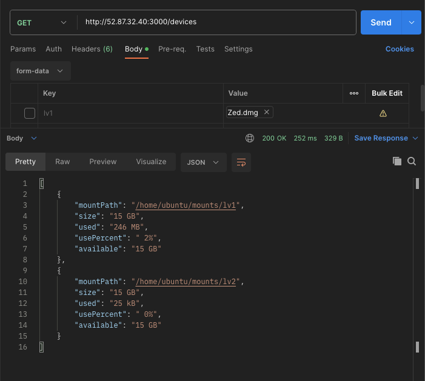

# EBS Playground

## How to run

A Taskfile has been provided to make running the various comands easier. Install task by following the instructions on the [official documentation](https://taskfile.dev/installation/)

> Note: The following commands were tailored to run in a linux environment and will not work as is if you are on a Mac or Windows

### Install dependencies

Run the following commands to install terraform and ansible

```shell
task install
```

### Deploy Terraform infrastructure

Run the following commands to deploy the initialize terraform and deploy the terraform infrastructure

```shell
task init
task apply
```

You need to create a .tfvars file in the terraform directoru and enter the value of your ssh public key

```terraform
# terraform/.tfvars
instance_public_key = "ssh-rsa AAAA...
```

### Generate Ansible inventory

Run the following command to generate the ansible inventory file

```shell
task gen_inventory
```

### Configure the instance with ansible

Run the following command to start the ebs-playground service on the instance

```shell
task ansible
```

Finally make requests to the `/devices` path of the ebs-playground service running on port 3000 of the instance to view the volumes created and upload files to the `/upload/lv1` and `/upload/lv2` paths to see the volume size change. The uploads must be of type `form-data` and have a key of `lv1` and `lv2` respectively depending on the path.




